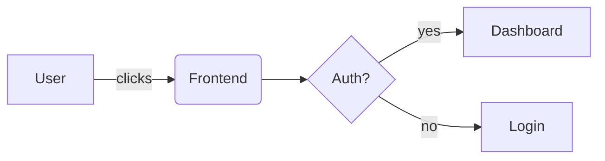

# Markdown Kitchen Sink

> Short, punchy demo of typical Markdown features you can copy into any project.

---

## Table of Contents
- [Headings](#headings)
- [Paragraphs & Emphasis](#paragraphs--emphasis)
- [Blockquotes](#blockquotes)
- [Lists](#lists)
- [Links & Images](#links--images)
- [Code](#code)
- [Tables](#tables)
- [Task Lists](#task-lists)
- [Footnotes](#footnotes)
- [Details / Summary](#details--summary)
- [Callouts](#callouts)
- [Mermaid Diagram](#mermaid-diagram)
- [Horizontal Rule](#horizontal-rule)

---

## Headings

# H1
## H2
### H3
#### H4
##### H5
###### H6

---

## Paragraphs & Emphasis

Plain paragraph with some inline styles:
- *Italic* text
- **Bold** text
- ***Bold Italic*** text
- ~~Strikethrough~~
- Inline `code` and emoji 🎯

Line break with two trailing spaces  
Second line.

---

## Blockquotes

> “Programs must be written for people to read, and only incidentally for machines to execute.”
>
> — *Harold Abelson*

> Nested:
> > Inner quote

---

## Lists

### Unordered
- Item A
- Item B
    - Subitem B.1
    - Subitem B.2
- Item C

### Ordered
1. Step one
2. Step two
    1. Substep 2.1
    2. Substep 2.2
3. Step three

---

## Links & Images

Inline link: [OpenAI](https://openai.com)

Reference link: [Project Site][project]

Autolink: <https://example.com>

Inline image: 

Reference image: ![Logo][logo]

[project]: https://example.com/docs
[logo]: /logo.png?text=Logo

---

## Code

Inline `const x = 42`.

Fenced code (no language):
```
$ echo "hello"
```

JavaScript:
```js
export function greet(name) {
  return `Hello, ${name}!`;
}
console.log(greet("Olex"));
```

Bash:
```bash
#!/usr/bin/env bash
set -euo pipefail
echo "Deploying..."
```

JSON:
```json
{
  "name": "demo",
  "version": "1.0.0",
  "private": true
}
```

---

## Tables

| Feature        | Supported | Notes                    |
|:---------------|:---------:|--------------------------|
| Alignment      |   Yes     | Left/Center/Right        |
| Code in cells  |   Yes     | `inline` works           |
| Multiline      |   No      | Use `<br>` if necessary  |

---

## Task Lists

- [x] Write skeleton
- [x] Add examples
- [ ] Polish content
- [ ] Ship it

---

## Footnotes

Here is a statement that needs a citation.[^1] And another one.[^note]

[^1]: This is a footnote. You can put links and *formatting* inside it.
[^note]: Second footnote for demonstration.

---

## Details / Summary

<details>
  <summary><strong>Click to expand</strong></summary>

Hidden content with **Markdown** inside:

- Bullet points
- Code:

  ```ts
  type ID = string | number;
  ```

</details>

---

## Callouts

> **Note:** Keep your README short; link to docs for depth.

> **Tip:** Prefer reference-style links for reuse.

> **Warning:** Don’t commit secrets.

---

## Mermaid Diagram



---

## Horizontal Rule

Above this line was content.

---
